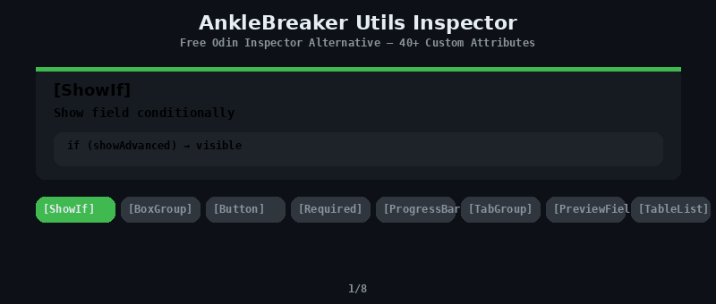

<p align="center">
  
</p>

# AnkleBreaker Utils Inspector — Free Odin Inspector Alternative

> **40+ custom inspector attributes and property drawers for Unity Editor.** ShowIf, BoxGroup, TabGroup, Button, Required, ProgressBar, PreviewField, TableList, and more — everything you need without the Odin price tag. Free and open source by [AnkleBreaker Studio](https://github.com/AnkleBreaker-Studio).

[](https://github.com/sponsors/AnkleBreaker-Studio)
[](https://assetstore.unity.com/publishers/101837)

## Installation

Add via Unity Package Manager using the Git URL:

```
https://github.com/AnkleBreaker-Studio/AnkleBreaker-Utils-Inspector.git#Release
```

## Attributes

### Conditional Visibility & Enable

| Attribute | Description |
|-----------|-------------|
| `[ShowIf("field")]` | Shows field conditionally based on a bool, enum value, or method |
| `[ShowIf("field", value)]` | Shows field when field equals value |
| `[HideIf("field")]` | Hides field conditionally |
| `[HideIf("field", value)]` | Hides field when field equals value |
| `[EnableIf("field")]` | Enables/disables field based on condition |
| `[EnableIf("field", value)]` | Enables field when field equals value |
| `[DisableInPlayMode]` | Disables field during play mode |
| `[DisableInEditorMode]` | Disables field in editor mode |

### Layout & Grouping

| Attribute | Description |
|-----------|-------------|
| `[BoxGroup("name")]` | Groups fields in a labeled box |
| `[BoxGroup("name", foldable: true)]` | Foldable box group |
| `[FoldoutGroup("name")]` | Collapsible foldout group |
| `[TabGroup("tab")]` | Organizes fields into tabs |
| `[HorizontalGroup("name")]` | Places fields side by side |
| `[HorizontalGroup("name", 0.5f)]` | Horizontal with custom width ratio |
| `[PropertyOrder(n)]` | Controls field display order |
| `[PropertySpace(before, after)]` | Adds spacing around a field |
| `[SectionHeader("title")]` | Draws a section header (CenterLine style, default) |
| `[SectionHeader("title", SectionHeaderStyle.Line)]` | Bold label + thin line below |
| `[SectionHeader("title", SectionHeaderStyle.Box)]` | Dark box behind title |
| `[SectionHeader("title", SectionHeaderStyle.Clean)]` | Bold label only, no decoration |

### Field Display

| Attribute | Description |
|-----------|-------------|
| `[ReadOnly]` | Makes field read-only in inspector |
| `[LabelText("text")]` | Custom label for inspector field |
| `[HideVariableName]` | Hides the variable name in inspector |
| `[HideInNormalInspector]` | Hides field in default inspector |
| `[SuffixLabel("unit")]` | Appends unit text after field (ms, px, %, etc.) |
| `[GUIColor(r, g, b)]` | Tints the field with a color |
| `[FolderPath]` | Folder picker with browse button |
| `[FreeRange(min, max)]` | Slider that allows values outside range |

### Buttons & Toggles

| Attribute | Description |
|-----------|-------------|
| `[Button]` | Displays a method as a clickable button |
| `[Button("Label")]` | Button with custom label |
| `[Button(Mode = ButtonMode.EnabledInPlayMode)]` | Play-mode-only button |
| `[ToggleButton]` | Boolean displayed as a colored toggle button |
| `[ToggleButton("On", "Off")]` | Toggle with custom labels |
| `[ToggleButton(big: true)]` | Double-height toggle button |
| `[InlineButton("method", "label")]` | Small button next to a field |
| `[EnumToggleButtons]` | Enum displayed as toggle button toolbar |

### Validation & Info

| Attribute | Description |
|-----------|-------------|
| `[Required]` | Marks a reference field as required |
| `[Required("message")]` | Required with custom warning message |
| `[ValidateInput("method", "msg")]` | Custom validation with error/warning |
| `[HelpBox("msg", type)]` | Displays a help box above the field |
| `[InfoBox("msg")]` | Informational message box |
| `[ABToolTip("method")]` | Dynamic tooltip from a method |

### Data & Input

| Attribute | Description |
|-----------|-------------|
| `[ValueDropdown("member")]` | Dropdown from a list field or method |
| `[OnValueChanged("method")]` | Calls a method when value changes |
| `[MinMaxSlider(min, max)]` | Range slider for Vector2 fields |
| `[ProgressBar(min, max)]` | Displays float as a colored progress bar |
| `[AutoCompleteText(keys)]` | Text field with autocomplete suggestions |

### Preview & Advanced

| Attribute | Description |
|-----------|-------------|
| `[PreviewField]` | Asset preview with metadata (dimensions, file size, path) |
| `[PreviewField(80)]` | Custom preview size. Supports Texture2D, Sprite, Mesh, GameObject |
| `[InlineEditor]` | Draws ScriptableObject fields inline |
| `[TableList]` | Draws list as a sortable table |
| `[ShowInInspector]` | Shows non-serialized fields/properties (read-only) |

## Serialized Classes

- `AB_SerializedDictionary<TKey, TValue>` — Serializable dictionary for Unity inspector

## Editor Utilities

- `ABGroupedEditor` — Base editor class handling all grouping, conditional visibility, and layout
- `ABEditor` — Base editor class with utility methods

## Why Choose This Over Odin Inspector?

Odin Inspector is a great tool, but it costs $55+ per seat. AnkleBreaker Utils Inspector provides the most commonly used attributes — ShowIf, BoxGroup, TabGroup, Button, Required, ProgressBar, PreviewField, TableList, and more — completely free and open source. It covers 90% of what most Unity developers use Odin for, at zero cost.

## Part of the AnkleBreaker Ecosystem

| Package | Description |
|---------|-------------|
| [AnkleBreaker-Core](https://github.com/AnkleBreaker-Studio/AnkleBreaker-Core) | Base classes, interfaces, delegates |
| **Utils-Inspector** (this) | 40+ custom inspector attributes |
| [Utils-Extensions](https://github.com/AnkleBreaker-Studio/AnkleBreaker-Utils-Extensions) | 50+ C# extension methods for Unity |
| [Utils-UniversalTypes](https://github.com/AnkleBreaker-Studio/AnkleBreaker-Utils-UniversalTypes) | Universal wrappers for localization, assets, audio |
| [Unity MCP](https://github.com/AnkleBreaker-Studio/unity-mcp-server) | 268 AI tools for Unity Editor control |

## Requirements

- Unity 2022.3 LTS or later

## License

See [LICENSE.md](LICENSE.md)
